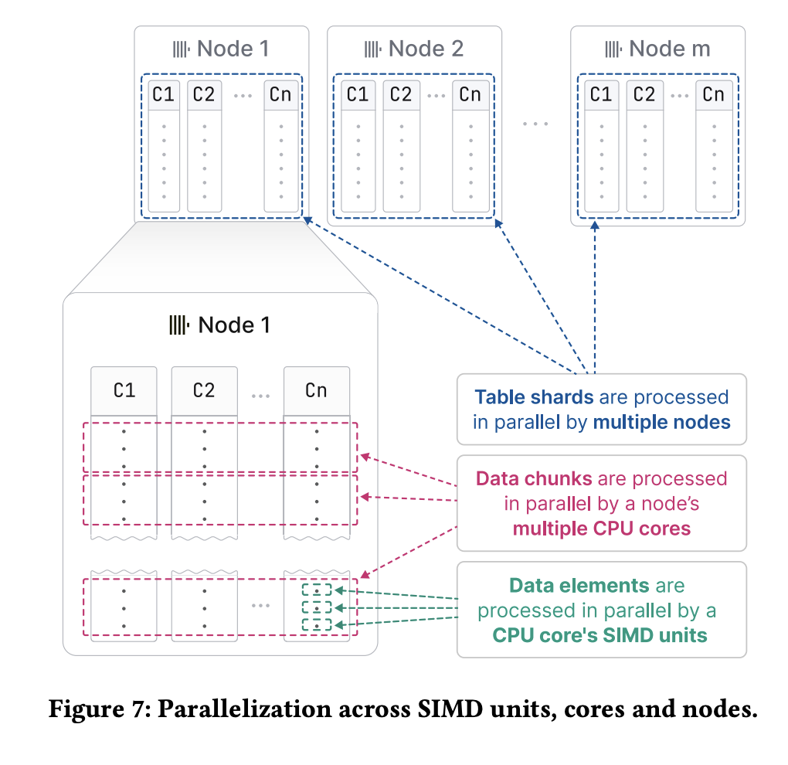

[Link to the VLDB paper](https://www.vldb.org/pvldb/vol17/p3731-schulze.pdf)



## Summary

* Distributed, analytical database optimized for high ingestion rates
* Besides horizontal scalability, all major decisions revolve around
    1. High data ingestion rates
    2. Fast query execution

From section-2 of the paper

* Columnar database with [LSM tree](https://en.wikipedia.org/wiki/Log-structured_merge-tree) based table storage: called `MergeTree` in the paper.
* Highly optimized for the use case where the data is ingested once and is queried, but
updates and deletes are non-atomic with the concurrent queries.
* It is NOT fully ACID compliant. Hence, **good for use cases where the small risk of losing new data is tolerable**.
* Vectorized query execution engine to maximize parallelism
    * Table shards are processed in parallel by multiple nodes
    * Data chunks within a node are processed by multiple cores
    * Individual data elements are processed by SIMD operators
    * Compile queries with LLVM to make them even faster

## Physical storage layer: MergeTree table engine
Each table is organized as a collection of **immutable** "parts". A part is self-contained and has all the metadata required to interpret the contents without looking up the central metadata store. A part is created whenever a set of rows is added and bulk inserts are recommended to avoid creating lots of small parts.

**Typical in LSM trees**: A background job merges multiple parts into a single large part until the size reaches a configurable threshold. The columns are sorted in the order of the primary key column and hence, an efficient k-way merge algorithm is used.

### Parts, Blocks, Granules

* Part corresponds to a filesystem directory, usually containing **one file per column**
* Rows within a part are further divided into groups of 8192 records, called **Granules**
* **Blocks** are basic read/write unit and consist of multiple **Granules**
    * Several neighboring granules are combined to form a block which is around 1MB by default
    * The number of blocks in the Granule is variable and depends on the column's data type and
      the distribution of values. For instance, it is possible to have fewer granules in a block
      if the column consists of lots of long strings because each value of the column takes up
      more space.
    * Smallest unit which is compressed. Various compression algorithms like LZ4, Gorilla, FPC
      (for floating-point data) are used and multiple algorithms can be chained.
    * Scan and index lookup operators process granule level. But the actual read/write of the
      table column files happen at the block level.
* Enabling random access to granules despite compression
    * Maintain granule ID to offset of the block in the compressed table file
    * Maintain granule offset within the uncompressed block

### Special encoding of columns
* Enabling dictionary encoding with a special wrapper type `LowCardinality(T)` for the columns
  where the number of values is low. Dictionary encoding replaces the values with integers to
  reduce the size of the column and to enable better compression in the block compression step

TODO: Show dictionary encoding in picture

* The `Nullable(T)` type adds an internal bitmap to column T to compactly represent NULL values.
  This is a common trick in the database engines for space-efficient NULL value storage.

TODO: Show nullable bitmap in picture

### Merging different parts
For efficient query processing, the number of parts have to be kept small to avoid jumping around. Like many LSM tree implementations, there is a background worker responsible for merging the parts into bigger ones until it hits some maximum size. Clickhouse supports different methods

| Merging method | Description |
|----------------|-------------|
| Replacing | Keep the most recent "version" of the row. By default it is the creation timestamp, but custom "version" column can be computed and specified to customize the behavior |
| Aggregating | More general version of replacing merge. Partial aggregation states like `sum()` and `avg()` are combined |
| TTL | For use cases like moving historical data to archival, another (possibly slower) volume, re-compress with a different, much more storage-efficient codec or even delete the part |

### Table partitioning across nodes
Distributing across the nodes is required to **horizontally scale** the amount of data a table can hold and also to improve the query execution speed by distributing processing across them. Clickhouse supports various common partitioning strategies to distribute the table data over multiple nodes: range, hash, round-robin and custom partition expression.

It also supports creating advanced column statistics for providing cardinality estimate of each partition (and these are important for **data pruning** which greatly improves query performance by eliminating the table partitions that need not be looked up)
* Approximate set cardinality with HyperLogLog
* Approximate distribution with T-digest

### Table projections
Alternative version of the table where the rows are sorted by a different primary key to speed up the queries filtering on that column. This is similar to creating indexes except that the data is also stored alongside making it a copy of the table with different data organization

## Data Replication
Like in many distributed databases, this is done to improve the availability of the data for queries and for fault tolerance (to tolerate node and disk failures, data corruption in one of the shards and so on). Unlike many other databases, it doesn't replicate each and every row which will be very expensive for high write ingestion. Instead, it will write a single record for each table part created.

The state of the table is represented by **table states** which consist of
1. Set of columns representing the table along with their type
1. Set of table parts as discussed in the previous sections

The replication log is stored in a cluster of Clickhouse Keeper nodes. Like many modern systems, [Raft](https://raft.github.io/raft.pdf) is used for consensus. The log entries are replayed asynchronously by each node starting from the beginning, implying that it is only eventually consistent and the newly ingested data may not be available for the subsequent queries for some time if they hit a node which is yet to replicate the newly added part. It is mentioned in the paper

> i.e. nodes can temporarily read old table states while converging towards the latest state

## Query processing

"Lightning fast analytics" would require super-fast query processing. At a high level (and also based on the data structures described in the physical storage layer), it works as follows
1. Distribute query processing to multiple nodes
1. Within each node
    1. Narrow down the table parts to be processed
    1. Use pruning mechanisms like different types of skip indexes
    1. Only read the blocks/granules necessary
    1. Divide into **data chunks** and use multiple cores to process through them
    1. Process the rows with **SIMD** wherever possible

### Pruning strategies
Additional data structures are created to efficiently skip and narrow down the granules (smallest unit of query processing) to be processed.

#### Sparse index of primary key to granule
Map keyed by the value of the first row of the granule of primary key column to the granule ID. This index is sparse and can easily fit into memory. One entry addresses 8192 rows and hence 1000 entries are enough to address ~8.1 million rows and hence easily fits in memory.

#### Skipping indexes
Store small amounts of metadata at the level of multiple granules (configurable) to allow skipping whole granules or blocks altogether (saves disk I/O and subsequent processing)

| Index type | Description |
|------------|-------------|
| Min-max indexes | storing minimum and maximum values for the range covered by the index |
| Set indexes | storing the set of values in the index block. Good when the cardinality is small and bounded |
| Bloom filter | can be created by a configurable false positive rate. As bloom filters are compact, they can be loaded into memory and can be checked to determine if the queried key definitely does NOT exist |