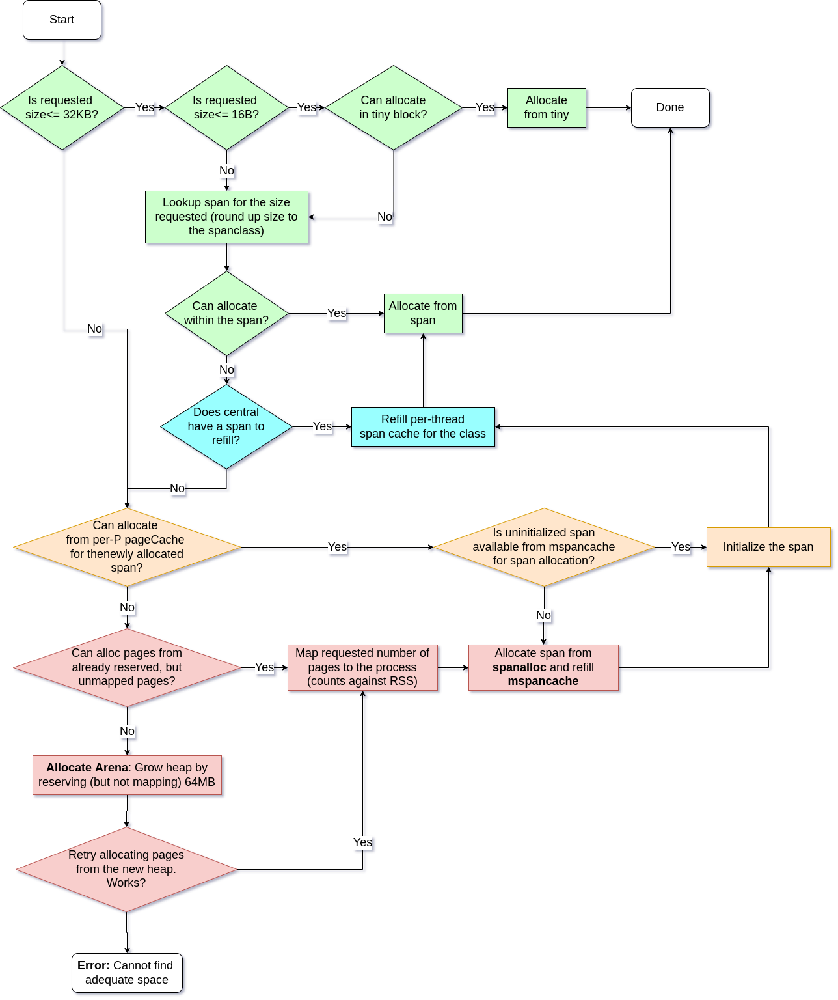
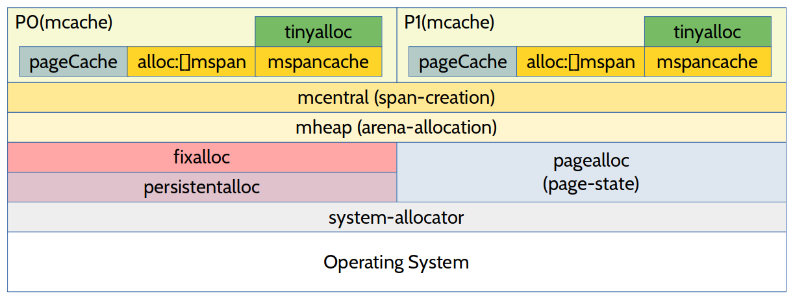
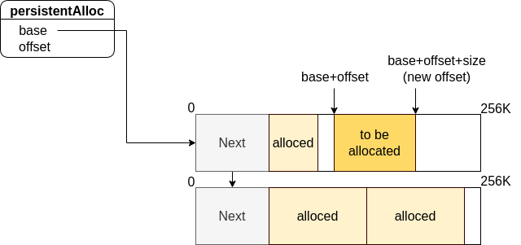
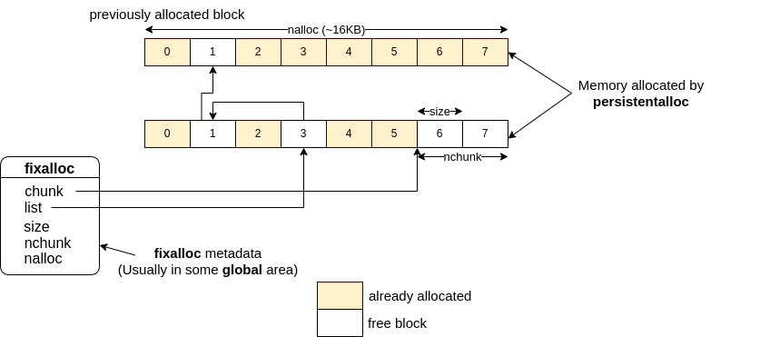

The Go programming language (Golang) is very simple to learn and provides some
nice concurrency features. However, the runtime machinery is very complex.
In the series of posts, I'll walk through the **source code** implementing
various parts of the machinery like memory allocation, garbage collection,
scavenging, scheduler, lifecycle of goroutines etc with illustrations.

> **Note:** that the source code is a moving target and in
> this post, I'm using the code from the `master` branch of the 
> [repo](https://github.com/golang/go) with the last commit SHA being 
> `c847a2c9f024f47eee25c132f2d80e7037adea36`. I assume 64-bit `amd64`
> architecture while explaining topics.

Before proceeding, I recommend reading an overview of 
[Go scheduler](https://www.ardanlabs.com/blog/2018/08/scheduling-in-go-part1.html),
[Garbage Collection](https://www.ardanlabs.com/blog/2018/12/garbage-collection-in-go-part1-semantics.html).
Go ahead and read the details only if you are curious about the actual implementation.
**Most likely, this does not help your day-to-day job using Go**.

**How memory for the dynamic data structures like slice is allocated?**
Take a look at the code below
```go
// Allocate a slice with capacity 10. This means
// space for 10 integers is reserved in the "heap"
arr := make([]int, 0, 10)

// Allocate space for a new integer on the heap
ptr := new(int)

// Create a new map from integer to integer
m := make(map[int]int)

// Create a new string (actually not dynamic, but
// the space itself could be allocated at runtime as
// is could have been generated as part of transformations)
s := "abc"

// Where is the stack for the goroutine allocated?
// How does it grow as needed?
go doSomething()
```
Now, answer the following questions
1. Where does the memory for these structures come from? 
2. Who decides where exactly in memory these structures are placed?
3. How do these structures grow/shrink dynamically?
4. On growing, how to make sure that it does not step on other objects
  (maybe other slice, maps etc) that are already there in memory?

The answer to (1) and (2) is the go memory allocator (this post). The answer to the other
two is in the implementation of the slice type. 

When the process starts, usually there are areas in memory called text, stack, global, BSS 
and heap. The allocator is responsible for deciding where to place in the "heap" section. 
The stack here is NOT goroutine stack. It is called `systemstack` in code. The Goroutine stack, 
as we will see later, is allocated on the heap.

Let us peek into the source code for creating a slice [here](https://github.com/golang/go/blob/c847a2c9f024f47eee25c132f2d80e7037adea36/src/runtime/slice.go#L88-L104). Notice the function
called `mallocgc`. 


func makeslice(et *_type, len, cap int) unsafe.Pointer {
	mem, overflow := math.MulUintptr(et.size, uintptr(cap))
	if overflow || mem > maxAlloc || len < 0 || len > cap {
		// NOTE: Produce a 'len out of range' error instead of a
		// 'cap out of range' error when someone does make([]T, bignumber).
		// 'cap out of range' is true too, but since the cap is only being
		// supplied implicitly, saying len is clearer.
		// See golang.org/issue/4085.
		mem, overflow := math.MulUintptr(et.size, uintptr(len))
		if overflow || mem > maxAlloc || len < 0 {
			panicmakeslicelen()
		}
		panicmakeslicecap()
	}
	return mallocgc(mem, et, true)
}


So...It looks like `mallocgc` is the function which allocates the space
for the data structure somewhere in the "heap". In fact, calling `new` also 
calls this function. So this is the entry-point of the memory management subsystem.

# Summary for the impatient


Based on [Google's tcmalloc](https://google.github.io/tcmalloc/design.html)

Takeaways:
* Highly optimized for small object allocation (<= 32KB).
* Optimized for multi-threaded environment.
* For Object sizes between 32KB and 512KB, taking a lock can be avoided sometimes
  with the use of per-P `pageCache` if allocation does not require page-alignment.
* Anything above that is directly allocated on the heap which could mean holding the
  lock on the global `mheap_` data structure. This limits concurrency (the Red blocks)
* It can be visualized as levels of allocators to balance between the amount of excess
  memory mapped to the process, the cost of holding the global lock and the speed of
  allocation. Hence it is called "thread-cached" malloc.
* No pointers like `*int` are returned.



The allocator can be visualized as a layer of multiple allocators and caches with
some requiring locks and others being per-thread.




Anything that calls the memory management subsystem for allocating on the heap 
is **forbidden** as it creates a circular dependency. That means
* No `make([]type, len, capacity)` and `make(map[keytype]valuetype)`.
* No `defer` or `go func()` calls. The goroutine stack is allocated on the heap.
* The `append(slice, elem)` does not work because it also makes heap allocations.
* The `new` call also calls `mallocgc` and hence cannot be used.
* `map` cannot be used because the key-value pair is also on the heap.

## "Allocator-internal" allocators
Allocator also has many dynamic data structures like slices, linked-lists, bitmaps etc.
How is memory allocation handled here? Now it is a chicken-and-egg problem where
the allocator which is responsible for dynamic memory allocation (and freeing)
itself needs one. These are allocated **off-heap** and usually they are not swept.

Fortunately, these allocators can be specialized leading to very simple algorithms as 
we shall see shortly. There are two such "internal allocators" used to allocate `arenaHints`,
`span` and `cache` related structures.

* `fixalloc`
* `persistentalloc`

### Persistent allocator - `persistentalloc`
* Grows in **256KB** chunks and the allocated memory is **not freed**
* A simple **linked list of 256KB blocks** with address of the next block obtained from the OS.
* There is both per-P and the global persistent allocators. The latter needs a lock

#### Data structure


#### Allocation
Some annotations are mine (marked with `@me`) and I have filtered out 
the code that is not important for understanding how persistent allocator works.

func persistentalloc1(size, align uintptr, sysStat *sysMemStat) *notInHeap {
	// ..omitted

    // @me: maxBlock=64K. Ask OS directly
	if size >= maxBlock {
		return (*notInHeap)(sysAlloc(size, sysStat))
	}

	var persistent *persistentAlloc
	
    // .. omitted

    // @me: If the request does not fit in the current block, then ask OS for
    // 256K (persistentChunkSize) with `sysAlloc`
	if persistent.off+size > persistentChunkSize || persistent.base == nil {
		persistent.base = (*notInHeap)(sysAlloc(persistentChunkSize, &memstats.other_sys))
		// .. omitted

		// Add the new chunk to the persistentChunks list.
        // @me: The new chunk is added from the front of the list. The `persistentChunks`
        //      holds a pointer to the head of the linked list. The atomic operation is
        //      setting the head after updating the first word to be the previous head.
        //      This way, the blocks allocated earlier are linked to the one just alloced.
		for {
			chunks := uintptr(unsafe.Pointer(persistentChunks))
			*(*uintptr)(unsafe.Pointer(persistent.base)) = chunks
			if atomic.Casuintptr((*uintptr)(unsafe.Pointer(&persistentChunks)), chunks, uintptr(unsafe.Pointer(persistent.base))) {
				break
			}
		}

        // @me: Take alignment into account
		persistent.off = alignUp(goarch.PtrSize, align)
	}
    // @me: Address to be returned and advance the offset
	p := persistent.base.add(persistent.off)
	persistent.off += size

    // .. omitted

	return p
}


* If the allocation request exceeds **64KB**, ask the OS directly.
* If the allocation size fits in the block (as shown), then bump the pointer taking alignment
  into account (hence the hole in the upper block).
* If it does not fit into the block, then ask the OS for another **256KB** chunk, set the next
  pointer to be the block that just ran out of space. Update the `persistentAlloc` data structure
  with the new base being the just allocated block. Then bump the pointer again.

#### Example usage
In `runtime/malloc.go`. The following code is resizing `allArenas` slice. The usual `append`
cannot be used in the allocator code. This is the equivalent of `append` when persistent allocator
is used (The following code also shows deliberate memory leak within the allocator code).
```go
if len(h.allArenas) == cap(h.allArenas) {
    size := 2 * uintptr(cap(h.allArenas)) * goarch.PtrSize
    if size == 0 {
        size = physPageSize
    }
    newArray := (*notInHeap)(persistentalloc(size, goarch.PtrSize, &memstats.gcMiscSys))
    if newArray == nil {
        throw("out of memory allocating allArenas")
    }
    oldSlice := h.allArenas
    *(*notInHeapSlice)(unsafe.Pointer(&h.allArenas)) = notInHeapSlice{newArray, len(h.allArenas), int(size / goarch.PtrSize)}
    copy(h.allArenas, oldSlice)
    // Do not free the old backing array because
    // there may be concurrent readers. Since we
    // double the array each time, this can lead
    // to at most 2x waste.
}
```

### Fixed allocator - `fixalloc`


* Chunk size is **16KB**
* The size of the object allocated here is fixed.
* Simple [free-list](https://en.wikipedia.org/wiki/Free_list) algorithm.
* The memory is allocated from [persistentalloc](#persistent-allocator---persistentalloc)

Full declaration
```go
type fixalloc struct {
	size   uintptr
	first  func(arg, p unsafe.Pointer) // called first time p is returned
	arg    unsafe.Pointer
	list   *mlink
	chunk  uintptr // use uintptr instead of unsafe.Pointer to avoid write barriers
	nchunk uint32  // bytes remaining in current chunk
	nalloc uint32  // size of new chunks in bytes
	inuse  uintptr // in-use bytes now
	stat   *sysMemStat
	zero   bool // zero allocations
}
```

If you'd like to follow - [Link to implementation](https://github.com/golang/go/blob/3cf79d96105d890d7097d274804644b2a2093df1/src/runtime/mfixalloc.go)

#### Allocation
[Implementation](https://github.com/golang/go/blob/3cf79d96105d890d7097d274804644b2a2093df1/src/runtime/mfixalloc.go#L73-L101). Some annotations are mine


func (f *fixalloc) alloc() unsafe.Pointer {
	if f.size == 0 {
		print("runtime: use of FixAlloc_Alloc before FixAlloc_Init\n")
		throw("runtime: internal error")
	}

    // @me: Step 1 : Check if we can allocate from free list
	if f.list != nil {
		v := unsafe.Pointer(f.list)
		f.list = f.list.next
		f.inuse += f.size
		if f.zero {
			memclrNoHeapPointers(v, f.size)
		}
		return v
	}

    // @me: Step 2: If we have run out of space, then allocate extra memory
    // from `persistentalloc`.
	if uintptr(f.nchunk) < f.size {
		f.chunk = uintptr(persistentalloc(uintptr(f.nalloc), 0, f.stat))
		f.nchunk = f.nalloc
	}

    // @me: Step 3: Bump the pointer and allocate.
	v := unsafe.Pointer(f.chunk)
	if f.first != nil {
		f.first(f.arg, v)
	}
	f.chunk = f.chunk + f.size
	f.nchunk -= uint32(f.size)
	f.inuse += f.size
	return v
}


1. First, check if there are any objects available in the free-list. If yes, then allocate
   from there and update the head pointer of the free-list to point to the next one.
2. If there is not enough space, then ask [persistentalloc](#persistent-allocator---persistentalloc)
   for approximately **16KB** of space.
3. Bump the pointer in the chunk (new or old).

#### Free
It just appends to the head of the free list. [Implementation](https://github.com/golang/go/blob/3cf79d96105d890d7097d274804644b2a2093df1/src/runtime/mfixalloc.go#L103-L108)


func (f *fixalloc) free(p unsafe.Pointer) {
	f.inuse -= f.size
	v := (*mlink)(p)
	v.next = f.list
	f.list = v
}


**NOTE**:
1. Double-free leads to cycles in the free-list.
2. From (1), Freeing the same memory back-to-back leads to self-referential cycle in the free-list. 
3. Memory leak means some area is permanently shaded and it never makes it to the free-list for recycling.

#### Usages
The entire heap is represented by a global `mheap_` structure. The `mspan`, `mcache` structures containing
the metadata for the per-P cache and the spans area allocated by `fixedalloc`.
```go
spanalloc  fixalloc // allocator for span*
cachealloc fixalloc // allocator for mcache*
```

## Initialization of memory management data structures
TODO: Add diagram with memory region label of how things look like after initialization

## `sysalloc` and mapping pages from the OS
TODO: Add the state transition diagram along with the explanation of various states
with attribution to the comments in the source code itself. I have not dived too deep
into the assembly code that is in there. This is the missing part in my understanding
that needs to be filled.

## `pagealloc` and Page chunk allocation

### Page bitmap
TODO: Add illustration of addressing (what bit maps to what range)
TODO: Explain what bitmap means and some optimizations

### Summary data structure
TODO: Add illustration of addressing and radix tree diagram
TODO: Explain the radix tree data structure and aggregation

### Page chunk allocation

### `pageCache` allocation

### Growing by mapping more pages

### Freeing pages

## `mheap` and Arena allocation
### `heapArena` data structure
### `heapBits` bitmap data structure

## `mcentral` and span allocation
### `partial` and `full` unswept linked list

## `mspan` and allocation within the span

## `mcache` and per-P allocation
## `tinyalloc` and allocating tiny objects (<= 16 bytes)

## `stackalloc` and managing goroutine stacks

## Brief detour - representing type information

## `gcbits` field
### GC Program kind

## `ptrdata` field

## Putting everything together
Congratulations if you have made this far! It is time to put all the things we learned
together and get into the steps in the flowchart.