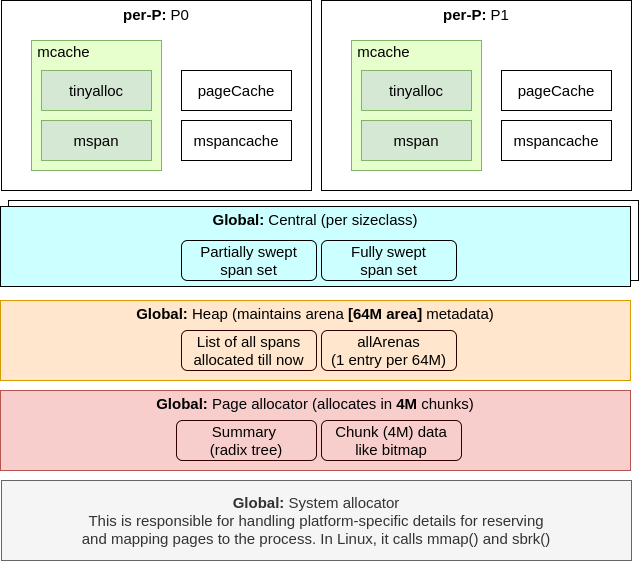

The Go programming language (Golang) is very simple to learn and provides some
nice concurrency features. However, the runtime machinery is very complex.
In the series of posts, I'll walk through the **source code** implementing
various parts of the machinery like memory allocation, garbage collection,
scavenging, scheduler, lifecycle of goroutines etc with illustrations.

> **Note:** that the source code is a moving target and in
> this post, I'm using the code from the `master` branch of the 
> [repo](https://github.com/golang/go) with the last commit SHA being 
> `c847a2c9f024f47eee25c132f2d80e7037adea36`. I assume 64-bit `amd64`
> architecture while explaining topics.

Before proceeding, I recommend reading an overview of 
[Go scheduler](https://www.ardanlabs.com/blog/2018/08/scheduling-in-go-part1.html),
[Garbage Collection](https://www.ardanlabs.com/blog/2018/12/garbage-collection-in-go-part1-semantics.html).
Go ahead and read this article only if you are curious about the actual implementation.
Most likely, this does not help your day-to-day job using Go.
 
```go
// Allocate a slice with capacity 10. This means
// space for 10 integers is reserved in the "heap"
arr := make([]int, 0, 10)

// Allocate space for a new integer on the heap
ptr := new(int)

// Create a new map from integer to integer
m := make(map[int]int)

// Create a new string (actually not dynamic, but
// the space itself could be allocated at runtime as
// is could have been generated as part of transformations)
s := "abc"

// Where is the stack for the goroutine allocated?
// How does it grow as needed?
go doSomething()
```
Here are some of the familiar statements in Go code. They all need memory to be dynamically
allocated somewhere in the "heap" region of memory. The function of the allocator is to decide
where exactly to allocate, given the size of memory requested. For instance, if a slice needs
to store 8 integers (8 bytes each), then it requests 64 bytes of memory. In Golang runtime,
the entrypoint to the allocator function is `mallocgc`. 

# Summary for the impatient
It can be visualized as layers of allocators to balance between the amount of excess
memory mapped to the process, the cost of holding the global lock and the speed of allocation. 
Hence it is called "thread-cached" malloc as shown below.



The implementation is based on [Google's tcmalloc](https://google.github.io/tcmalloc/design.html).
The allocator algorithm is summarized in the following flow-chart


Takeaways:
* Highly optimized for small object allocation (<= 32KB) and multi-threaded environments.
* For Object sizes between 32KB and 512KB, taking a lock can be avoided sometimes
  with the use of per-P `pageCache` if allocation does not require page-alignment.
* Anything above that is directly allocated on the heap which could mean holding the
  lock on the global `mheap_` data structure. This limits concurrency (the Red blocks)
* Deeper you go in the flowchart, slower it is.

---



# Into Go's memory allocator
We will now dive into the details of Golang's memory allocator subsystem including
walking through the source code. Anything that calls the memory management subsystem 
for allocating on the heap is **forbidden** as it creates a circular dependency. 
That means, in the allocator code
* No `make([]type, len, capacity)` and `make(map[keytype]valuetype)`.
* No `defer` or `go func()` calls. The goroutine stack is allocated on the heap.
* The `append(slice, elem)` does not work because it also makes heap allocations.
* The `new` call also calls `mallocgc` and hence cannot be used.
* `map` cannot be used because the key-value pair is also on the heap.

---

## `sysalloc` and mapping pages from the OS


This is where the Go runtime interacts with the underlying platform (in my case Linux)
to get pages of memory mapped into the process. In Linux, it calls `mmap`. Any region of
memory in the process space would be in one of the 4 states. To quote from the comments
in the source code [here](https://github.com/golang/go/blob/5c8ec89cb53025bc76b242b0d2410bf5060b697e/src/runtime/mem.go#L11-L20)

> Regions of the address space managed by the runtime may be in one of four
> states at any given time:
> 1) None - Unreserved and unmapped, the default state of any region.
> 2) Reserved - Owned by the runtime, but accessing it would cause a fault.
>               Does not count against the process' memory footprint.
> 3) Prepared - Reserved, intended not to be backed by physical memory (though
>               an OS may implement this lazily). Can transition efficiently to
>               Ready. Accessing memory in such a region is undefined (may
>               fault, may give back unexpected zeroes, etc.).
> 4) Ready - may be accessed safely.

Among all these the most important one is the **Ready** state. The memory used by allocator's
internal data structures and the application must be in this state. The following diagram shows
the state transition between various states


All the `sys*` functions call `mmap` in Linux with different set of flags and permission bits.
The call to [mmap](https://man7.org/linux/man-pages/man2/mmap.2.html) is implemented in assembly. 
Filling up SI, DI, DX, R10, R8, R9 registers is according to the Linux syscall calling convention
on amd64 architecture. The `SYS_mmap` refers to the syscall number of `mmap`. 

TEXT runtime·sysMmap(SB),NOSPLIT,$0
	MOVQ	addr+0(FP), DI
	MOVQ	n+8(FP), SI
	MOVL	prot+16(FP), DX
	MOVL	flags+20(FP), R10
	MOVL	fd+24(FP), R8
	MOVL	off+28(FP), R9

	MOVL	$SYS_mmap, AX
	SYSCALL
	CMPQ	AX, $0xfffffffffffff001
	JLS	ok
	NOTQ	AX
	INCQ	AX
	MOVQ	$0, p+32(FP)
	MOVQ	AX, err+40(FP)
	RET
ok:
	MOVQ	AX, p+32(FP)
	MOVQ	$0, err+40(FP)
	RET


---

## Internal allocators
Allocator also has many dynamic data structures like slices, linked-lists, bitmaps etc.
How is memory allocation handled here? Now it is a chicken-and-egg problem where
the allocator which is responsible for dynamic memory allocation (and freeing)
itself needs one. These are allocated **off-heap** and usually they are not swept.

Fortunately, these allocators can be specialized leading to very simple algorithms. There 
are two such "internal allocators" used to allocate `arenaHints`, `span` and `cache` related
structures.
* `fixalloc`
* `persistentalloc`

---

### Persistent allocator - `persistentalloc`
* Simple bump-the-pointer allocator.
* Grows in **256KB** chunks and the allocated memory is **not freed**
* A simple **linked list of 256KB blocks** with address of the next block obtained from the OS.
* There is both per-P and the global persistent allocators. The latter needs a lock


I have filtered out the code that is not important for understanding how persistent allocator works.
Here is the implementation and each of the steps are explained below

func persistentalloc1(size, align uintptr, sysStat *sysMemStat) *notInHeap {
	// ..omitted

	if size >= maxBlock {
		return (*notInHeap)(sysAlloc(size, sysStat))
	}

	var persistent *persistentAlloc
	
    // .. omitted

	if persistent.off+size > persistentChunkSize || persistent.base == nil {
		persistent.base = (*notInHeap)(sysAlloc(persistentChunkSize, &memstats.other_sys))
		// .. omitted
		for {
			chunks := uintptr(unsafe.Pointer(persistentChunks))
			*(*uintptr)(unsafe.Pointer(persistent.base)) = chunks
			if atomic.Casuintptr((*uintptr)(unsafe.Pointer(&persistentChunks)), chunks, uintptr(unsafe.Pointer(persistent.base))) {
				break
			}
		}

		persistent.off = alignUp(goarch.PtrSize, align)
	}
	p := persistent.base.add(persistent.off)
	persistent.off += size

    // .. omitted

	return p
}


The algorithm
* If the allocation request exceeds **64KB** (`maxBlock`), ask the OS directly.

if size >= maxBlock {
	return (*notInHeap)(sysAlloc(size, sysStat))
}


* If the allocation does not fit into the block, then ask the OS for another **256KB** chunk, set the next
  pointer to be the block that just ran out of space. Update the `persistentAlloc` data structure
  with the new base being the just allocated block.

if persistent.off+size > persistentChunkSize || persistent.base == nil {
	persistent.base = (*notInHeap)(sysAlloc(persistentChunkSize, &memstats.other_sys))
	for {
		chunks := uintptr(unsafe.Pointer(persistentChunks))
		*(*uintptr)(unsafe.Pointer(persistent.base)) = chunks
		if atomic.Casuintptr((*uintptr)(unsafe.Pointer(&persistentChunks)), chunks, uintptr(unsafe.Pointer(persistent.base))) {
			break
		}
	}
	persistent.off = alignUp(goarch.PtrSize, align)
}


* Bump the pointer taking alignment into account (hence the hole in the upper block).

p := persistent.base.add(persistent.off)
persistent.off += size
return p

---

### Fixed allocator - `fixalloc`


* Grows by **16KB** - memory is obtained from [persistentalloc](#persistent-allocator---persistentalloc) 
* The size of the object allocated here is fixed.
* Simple [free-list](https://en.wikipedia.org/wiki/Free_list) algorithm.

Full declaration

type fixalloc struct {
	size   uintptr
	first  func(arg, p unsafe.Pointer) // called first time p is returned
	arg    unsafe.Pointer
	list   *mlink
	chunk  uintptr // use uintptr instead of unsafe.Pointer to avoid write barriers
	nchunk uint32  // bytes remaining in current chunk
	nalloc uint32  // size of new chunks in bytes
	inuse  uintptr // in-use bytes now
	stat   *sysMemStat
	zero   bool // zero allocations
}


If you'd like to follow - [Link to implementation](https://github.com/golang/go/blob/3cf79d96105d890d7097d274804644b2a2093df1/src/runtime/mfixalloc.go)

#### Allocation
[Implementation](https://github.com/golang/go/blob/3cf79d96105d890d7097d274804644b2a2093df1/src/runtime/mfixalloc.go#L73-L101). Algorithm description

1. First, check if there are any objects available in the free-list. If yes, then allocate
   from there and update the head pointer of the free-list to point to the next one.

if f.list != nil {
	v := unsafe.Pointer(f.list)
	f.list = f.list.next
	f.inuse += f.size
	if f.zero {
		memclrNoHeapPointers(v, f.size)
	}
	return v
}

2. If there is not enough space, then ask [persistentalloc](#persistent-allocator---persistentalloc)
   for approximately **16KB** of space.

if uintptr(f.nchunk) < f.size {
	f.chunk = uintptr(persistentalloc(uintptr(f.nalloc), 0, f.stat))
	f.nchunk = f.nalloc
}

3. Bump the pointer in the chunk (new or old).

v := unsafe.Pointer(f.chunk)
if f.first != nil {
	f.first(f.arg, v)
}
f.chunk = f.chunk + f.size
f.nchunk -= uint32(f.size)
f.inuse += f.size
return v


#### Free
It just appends to the head of the free list. [Implementation](https://github.com/golang/go/blob/3cf79d96105d890d7097d274804644b2a2093df1/src/runtime/mfixalloc.go#L103-L108)


func (f *fixalloc) free(p unsafe.Pointer) {
	f.inuse -= f.size
	v := (*mlink)(p)
	v.next = f.list
	f.list = v
}


**NOTE**:
1. Double-free leads to cycles in the free-list.
2. From (1), Freeing the same memory back-to-back leads to self-referential cycle in the free-list. 
3. Memory leak means some area is permanently shaded and it never makes it to the free-list for recycling.

#### Usages
The entire heap is represented by a global `mheap_` structure. The `mspan`, `mcache` structures containing
the metadata for the per-P cache and the spans area allocated by `fixedalloc`.
```go
spanalloc  fixalloc // allocator for span*
cachealloc fixalloc // allocator for mcache*
```

---

## Initialization of memory management data structures
The memory management data structures are initialized at the start of the process before the main goroutine
is called. It initializes the `mheap_` data structure which lives in the global memory. The main steps in
`mheap_` initialization are as follows
* Initialize `spanalloc` and `cachealloc` which are [fixed allocators](#fixed-allocator---fixalloc)
* Initialize `mcentral` sizeclasses. 
* Initialize `pagealloc` which will be described next.

## `pagealloc` and Page chunk allocation
The page allocator is responsible for getting and returning pages from/to the underlying Operating System. 
It calls [system allocator](#sysalloc-and-mapping-pages-from-the-os) functions like `sysAlloc`, `sysFree` etc.
* Grows by **4MB** at a time or **512 pages**(8KB each) by getting memory from [**system allocator**](#sysalloc-and-mapping-pages-from-the-os).
* Allocates one or more pages at a time (minimum allocation is **8KB**)

Some important data structures are as follows

// .. many fields and comments are omitted
type pageAlloc struct {
	summary    [summaryLevels][]pallocSum
	chunks     [1 << pallocChunksL1Bits]*[1 << pallocChunksL2Bits]pallocData
	searchAddr offAddr
	start, end chunkIdx
	inUse      addrRanges
}


| Field | Description |
|-------|-------------|
| `inUse` | List of heap address ranges that are usable for allocation. That is, the amount of memory in `Ready` state |
| `searchAddr` | Address from which the search for the free space to service an allocation request starts |
| `chunks` | Each chunk consists of **512 pages**. It consists of the **bitmap** (512/64 = 8 64-bit integers per chunk). 1 means allocated. The only valid chunks are those which are in the address range in `inUse`. The rest of the memory won't be in `Ready` state and hence it could cause "segmentation fault" |
| `summary` | It represents a tree structure where each level contains the summary of the level below it. The lowest level represents the summary of a chunk containing (start, end, max). Start is the first page number within the range that is allocated. End is the last page number within the range represented that is allocated (in `chunks` bitmap, it would be 1). Max is the maximum gap in the range. The gap refers to the range which is allocated (largest segment with contiguous zeros in the area) |
| `start`, `end` | Start and end represent the chunk index known to `pagealloc`. These are manipulated while **growing** |

Pictorial representation


### Page bitmap
TODO: Add illustration of addressing (what bit maps to what range)
TODO: Explain what bitmap means and some optimizations

### Summary data structure
TODO: Add illustration of addressing and radix tree diagram
TODO: Explain the radix tree data structure and aggregation

### Page chunk allocation

### `pageCache` allocation

### Growing by mapping more pages

### Freeing pages

## `mheap` and Arena allocation
### `heapArena` data structure
### `heapBits` bitmap data structure

## `mcentral` and span allocation
### `partial` and `full` unswept linked list

## `mspan` and allocation within the span

## `mcache` and per-P allocation
## `tinyalloc` and allocating tiny objects (<= 16 bytes)

## `stackalloc` and managing goroutine stacks

## Brief detour - representing type information

## `gcbits` field
### GC Program kind

## `ptrdata` field

## Putting everything together
Congratulations if you have made this far! It is time to put all the things we learned
together and get into the steps in the flowchart.