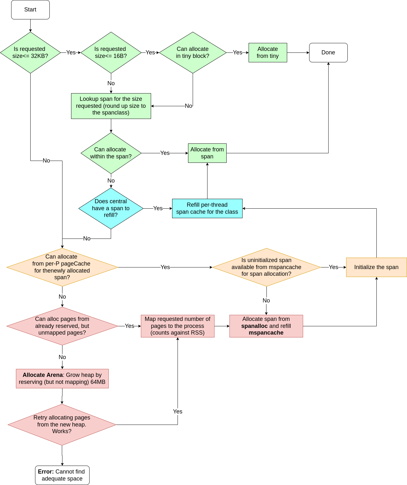

The Go programming language (Golang) is very simple to learn and provides some
nice concurrency features. However, the runtime machinery is very complex.
In the series of posts, I'll walk through the **source code** implementing
various parts of the machinery like memory allocation, garbage collection,
scavenging, scheduler, lifecycle of goroutines etc with illustrations.

> **Note:** that the source code is a moving target and in
> this post, I'm using the code from the `master` branch of the 
> [repo](https://github.com/golang/go) with the last commit SHA being 
> `c847a2c9f024f47eee25c132f2d80e7037adea36`. I assume 64-bit `amd64`
> architecture while explaining topics.

Before proceeding, I recommend reading an overview of 
[Go scheduler](https://www.ardanlabs.com/blog/2018/08/scheduling-in-go-part1.html),
[Garbage Collection](https://www.ardanlabs.com/blog/2018/12/garbage-collection-in-go-part1-semantics.html).
Go ahead and read the details only if you are curious about the actual implementation.
**Most likely, this does not help your day-to-day job using Go**.

**How memory for the dynamic data structures like slice is allocated?**
Take a look at the code below
```go
// Allocate a slice with capacity 10. This means
// space for 10 integers is reserved in the "heap"
arr := make([]int, 0, 10)

// Allocate space for a new integer on the heap
ptr := new(int)

// Create a new map from integer to integer
m := make(map[int]int)

// Create a new string (actually not dynamic, but
// the space itself could be allocated at runtime as
// is could have been generated as part of transformations)
s := "abc"

// Where is the stack for the goroutine allocated?
// How does it grow as needed?
go doSomething()
```
Now, answer the following questions
1. Where does the memory for these structures come from? 
2. Who decides where exactly in memory these structures are placed?
3. How do these structures grow/shrink dynamically?
4. On growing, how to make sure that it does not step on other objects
  (maybe other slice, maps etc) that are already there in memory?

The answer to (1) and (2) is the go memory allocator (this post). The answer to the other
two is in the implementation of the slice type. 

When the process starts, usually there are areas in memory called text, stack, global, BSS 
and heap. The allocator is responsible for deciding where to place in the "heap" section. 
The stack here is NOT goroutine stack. It is called `systemstack` in code. The Goroutine stack, 
as we will see later, is allocated on the heap.

Let us peek into the source code for creating a slice [here](https://github.com/golang/go/blob/c847a2c9f024f47eee25c132f2d80e7037adea36/src/runtime/slice.go#L88-L104). Notice the function
called `mallocgc`. 


func makeslice(et *_type, len, cap int) unsafe.Pointer {
	mem, overflow := math.MulUintptr(et.size, uintptr(cap))
	if overflow || mem > maxAlloc || len < 0 || len > cap {
		// NOTE: Produce a 'len out of range' error instead of a
		// 'cap out of range' error when someone does make([]T, bignumber).
		// 'cap out of range' is true too, but since the cap is only being
		// supplied implicitly, saying len is clearer.
		// See golang.org/issue/4085.
		mem, overflow := math.MulUintptr(et.size, uintptr(len))
		if overflow || mem > maxAlloc || len < 0 {
			panicmakeslicelen()
		}
		panicmakeslicecap()
	}
	return mallocgc(mem, et, true)
}


So...It looks like `mallocgc` is the function which allocates the space
for the data structure somewhere in the "heap". In fact, calling `new` also 
calls this function. So this is the entry-point of the memory management subsystem.

# Summary for the impatient


Takeaways:
* Highly optimized for small object allocation (<= 32KB).
* Optimized for multi-threaded environment.
* For Object sizes between 32KB and 512KB, taking a lock can be avoided sometimes
  with the use of per-P `pageCache` if allocation does not require page-alignment.
* Anything above that is directly allocated on the heap which could mean holding the
  lock on the global `mheap_` data structure. This limits concurrency (the Red blocks)
* It can be visualized as levels of allocators to balance between the amount of excess
  memory mapped to the process, the cost of holding the global lock and the speed of
  allocation. Hence it is called "thread-cached" malloc.



TODO: Add the layered diagram

Anything that calls the memory management subsystem for allocating on the heap 
is **forbidden** as it creates a circular dependency. That means
* No `make([]type, len, capacity)` and `make(map[keytype]valuetype)`.
* No `defer` or `go func()` calls. The goroutine stack is allocated on the heap.
* The `append(slice, elem)` does not work because it also makes heap allocations.
* The `new` call also calls `mallocgc` and hence cannot be used.
* `map` cannot be used because the key-value pair is also on the heap.

## "Allocator-internal" allocators
Allocator also has many dynamic data structures like slices, linked-lists, bitmaps etc.
How is memory allocation handled here? Now it is a chicken-and-egg problem where
the allocator which is responsible for dynamic memory allocation (and freeing)
itself needs one. These are allocated **off-heap** and usually they are not swept.

Fortunately, the allocators can be specialized leading to very simple free-list based
algorithms as we shall see shortly. There are two such "internal allocators" used
to allocate `arenaHints`, `span` and `cache` related structures.

* `fixalloc` - allocates objects of fixed size which is defined in advance. It uses a
   simple free-list based allocation algorithm where freed objects form a linked list.
   For expansion, it requests `persistentalloc` for more chunks.

* `persistentalloc` - maps pages directly from the Operating System and hands it over
   to the requester. This is used by `fixalloc`, by many slice structures within the
   memory management subsystem for allocating and growing. The usual `append` cannot
   be called from within the memory management subsystem. The memory allocated by this
   allocator is **not freed** at all.

### Persistent allocator - `persistentalloc`
### Fixed allocator - `fixalloc`

## Initialization of memory management data structures
TODO: Add diagram with memory region label of how things look like after initialization

## `sysalloc` and mapping pages from the OS
TODO: Add the state transition diagram along with the explanation of various states
with attribution to the comments in the source code itself. I have not dived too deep
into the assembly code that is in there. This is the missing part in my understanding
that needs to be filled.

## `pagealloc` and Page chunk allocation

### Page bitmap
TODO: Add illustration of addressing (what bit maps to what range)
TODO: Explain what bitmap means and some optimizations

### Summary data structure
TODO: Add illustration of addressing and radix tree diagram
TODO: Explain the radix tree data structure and aggregation

### Page chunk allocation

### `pageCache` allocation

### Growing by mapping more pages

### Freeing pages

## `mheap` and Arena allocation
### `heapArena` data structure
### `heapBits` bitmap data structure

## `mcentral` and span allocation
### `partial` and `full` unswept linked list

## `mspan` and allocation within the span

## `mcache` and per-P allocation
## `tinyalloc` and allocating tiny objects (<= 16 bytes)

## `stackalloc` and managing goroutine stacks

## Brief detour - representing type information

## `gcbits` field
### GC Program kind

## `ptrdata` field

## Putting everything together
Congratulations if you have made this far! It is time to put all the things we learned
together and get into the steps in the flowchart.