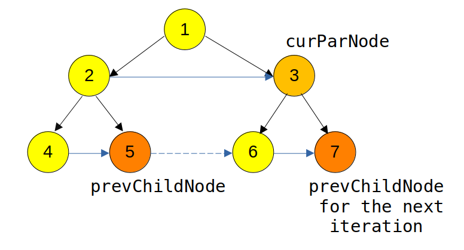

[Link to the problem](https://leetcode.com/problems/populating-next-right-pointers-in-each-node/)

**Brief description** - We are given a perfect binary tree. The task is to link each node with its
right one in the same level by filling `next` pointer. In the end, traversing `next` pointer from
the leftmost node in the level should allow us to traverse through the entire level

I solved it with two approaches. Both O(n) time-complexity and one of them with constant space.

## Approach 1 - Straightforward, level order traversal
* Time complexity - O(n)
* Space complexity - O(n)

Here, we start from the top-most level, iterate through all the nodes in the level and then link
the nodes together. At the same time, we also note down the children _in-order_ (left and then right).
Once we are done, we move to the next level by passing the list of children. This is done recursively.
This is easy to implement
```java
class Solution {
    public Node connect(Node root) {
        if (root == null) {
            return null;
        }
        List<Node> lev = new ArrayList<>();
        lev.add(root);
        doConnect(lev);
        return root;
    }
    
    private void doConnect(List<Node> lev) {
        if (lev.isEmpty()) {
            return;
        }
        for (int i = 1; i < lev.size(); i++) {
            Node prev = lev.get(i-1);
            prev.next = lev.get(i);     
        }
        List<Node> nextLev = new ArrayList<>();
        for (Node n : lev) {
            if (n.left != null) { nextLev.add(n.left); }
            if (n.right != null) { nextLev.add(n.right); }
        }
        doConnect(nextLev);
    }
}
```

## Approach 2 - Level order traversal through the parent level
* Time complexity - O(n)
* Space complexity - O(1)

Improving on the previous approach, here is an observation - how about starting from the leftmost
child in each level? We note down its parent and in the previous iteration, the right links at the
previous level are already filled. So, we can traverse through those links, inspect their children
and link them accordingly.

The method is illustrated in the following diagram


Here is the code. The first `while` loop iterates through the levels and the second one iterates
within each level

```java
class Solution {
    public Node connect(Node root) {
        if (root == null) { return null; }
        Node parNode = root;
        Node leftmostChildNode = leftmostChild(parNode);
        while (leftmostChildNode != null) {
            Node curParNode = parNode;
            Node prevChildNode = null;
            Node nextLeftmostNode = null;
            Node nextLeftmostParent = null;
            while (curParNode != null) {
                // If the node is a leaf then we don't have anything to
                // do here - no child nodes to link them together. Move on
                if (curParNode.left == null && curParNode.right == null) {
                    curParNode = curParNode.next;
                    continue;
                }
                
                // If this node has both the left and the right children
                // then the next of the left child would be the right child
                if (curParNode.left != null && curParNode.right != null) {
                    curParNode.left.next = curParNode.right;
                }
                if (prevChildNode != null) {
                    prevChildNode.next = leftmostChild(curParNode);
                }
                
                // At this point we know that at least there is one child node
                // for the next level. When we see the next leftmost as null it
                // means that all previous nodes at the child level did not have
                // any children. So try once again - the next leftmost would be
                // the "leftmost child of the leftmost child for this node"
                if (nextLeftmostNode == null) {
                    nextLeftmostNode = leftmostChild(leftmostChild(curParNode));
                    nextLeftmostParent = leftmostChild(curParNode);
                }
                prevChildNode = rightmostChild(curParNode);
                curParNode = curParNode.next;
            }
            parNode = nextLeftmostParent;
            leftmostChildNode = nextLeftmostNode;
        }
        return root;
    }
    
    private Node leftmostChild(Node curNode) {
        if (curNode == null) { return null; }
        return curNode.left != null ? curNode.left : curNode.right;
    }
    
    private Node rightmostChild(Node curNode) {
        if (curNode == null) { return null; }
        return curNode.right != null ? curNode.right : curNode.left;
    }
}
```